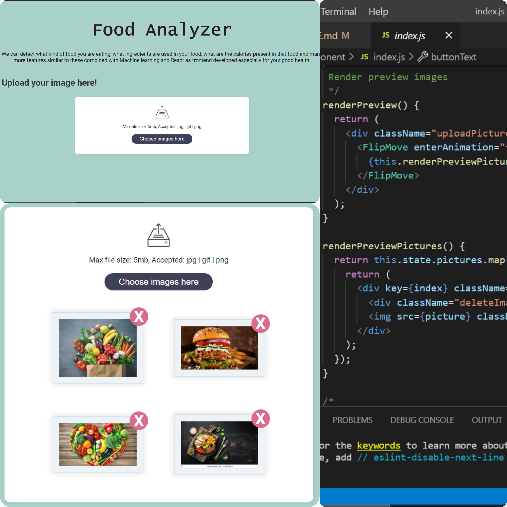

# React project - food-Analyzer-Web

<h2>Introduction🤩</h2>

> Food Analyzer is a web portal which detects what kind of food you are consuming, which ingredients are used, what are the calories present in the food and many more features similar to these. This is a Machine Learning project combined with React as frontend.

<h2>Features✨</h2>
<ul>
 <li>User Friendly Interface</li>
 <li>Efficient and time saving</li>
 <li>Minimal requirements needed</li>
 <li>Accessible from anywhere and anytime</li>
 <li>Eligible for all age groups</li>
</ul>

<h2>Workflow📌</h2>

Food analyzer keeps you updated about the food type, calories and ingredients in the food you are intaking in an interesting way for everyone to keep a check on your health status. The most amazing feature is the uploading images of your food and ta-da...it simply analyzes your food and gives you a report. You can upload multiple images at one go. It will help you in keeping yourself healthy and keeping a count on what you are consuming in a easy way.

<h2>How it helps the community🌼</h2>
<ul>
 <li>It analyzes food of various types.</li>
 <li>It identifies the various ingredients present in the food.</li>
 <li>It calculates the calories present in the food.</li>
 <li>It provides an interactive interface for everyone.</li>
</ul>

<h2>Tech stack Used💻</h2>
  <ul>
    <li>HTML</li>
    <li>CSS</li>
    <li>Javascript</li>
    <li>React</li>
    <li>Machine Learning</li>
  </ul>

<h2>Screenshots📸</h2>
  

## Intrested in building Flutter App

[FLutter Project food-Analyzer-App](https://github.com/abhishekpatelmc/food-Analyzer-App)

📫 How to reach me: [@abhishekpatelmc](https://www.linkedin.com/in/abhishekpatelmc/)
